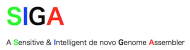

## What is SIGA?
SIGA - St. **S**ensitive and **I**ntelligent **G**enome **A**ssembler - is a *de* novo  assembly toolkit containing various assembly pipelines. 

## Quick start
For installation and usage instructions see [README](README) 
For running examples see [examples](examples) and the [siga wiki](https://github.com/chungongyu/siga/wiki) 

## Connect with us
mailto: [siga@ict.ac.cn](mailto:siga@ict.ac.cn)
